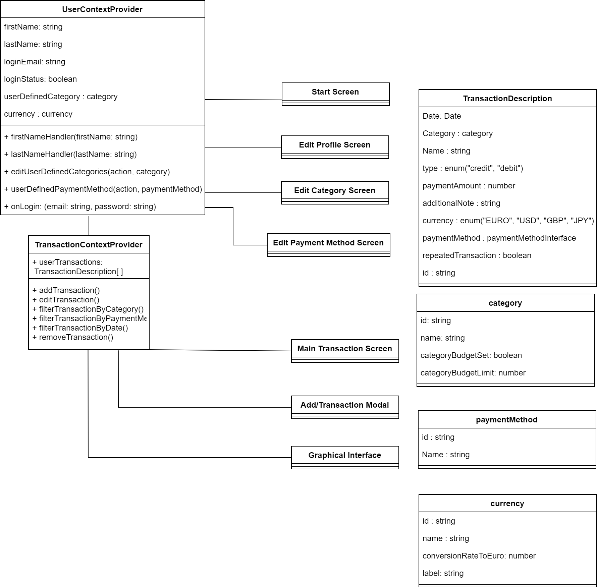

## Goals: 
1. Added Currency Conversion.
2. Added New Sync account page with email validator.
3. Edit, add or delete categories and payment methods.
4. Mostly UI components.

### New Category interface: 

id: string,
name: string,

### New Payment Interface:

id: string,
name: string,

### New CategoryThreshold Interface:

categoryId: string,
ThresholdValue: number,

## UI Feature:

### Sync Page (User Page --> Sync Account)

Added Email Validator in order to validate email format.

### Settings Page (User Page --> Settings)

Clicking on "Add..." will add a new type and clicking on the item will open a edit modal. Further, clicking on the bin item will delete the item.

## Component Diagram

