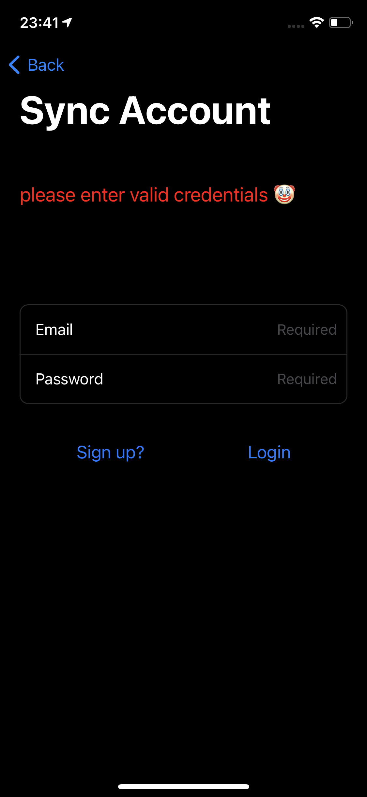
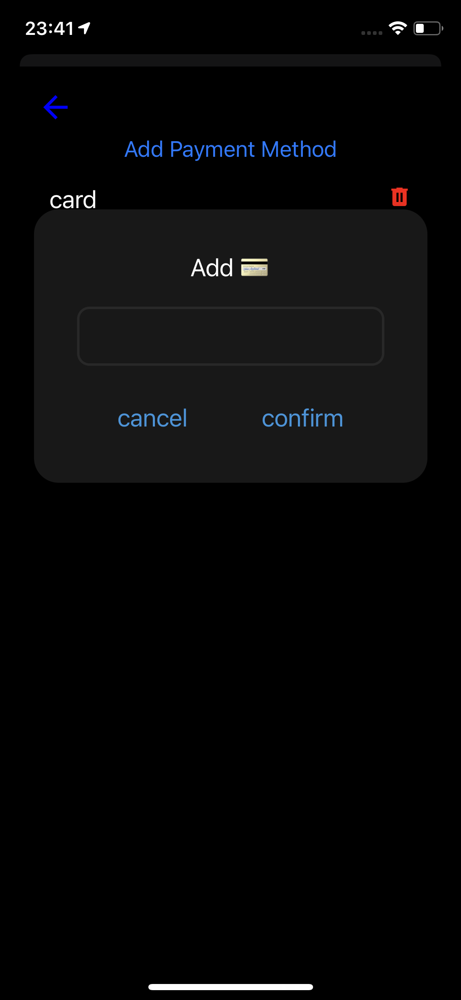

# State-Management

There are two state managements that manages the overall state of the application:

TransactionContextProvider: Manages all the transactions happening in the application. It contains the following attributes:

1. TransactionDescription[]
2. addTransaction()
3. editTransaction()

TransactionDescription is an object with the following properties:

1. date: Date;
2. category: category;
3. name: string;
4. type: userTransactionType;
5. paymentAmount: number;
6. paymentMethod?: paymentMethod;
7. additionalNote?: string;
8. currency: currency;
9. repeatedTransaction: boolean;
10. id: string;

UserContextProvider: Manages state of the user profile. It contains the following attributes:

1. userDefinedCategories: category[]
2. firstName: string (optional)
3. lastName: string (optional)
4. loginEmail: string (optional)
5. onLogin(email, password)
6. onLogout()
7. loginStatus: boolean

Filter Modal filters transactions on Main Transaction and Chart Screen. Added a date validator as well in the modal. Filter can be on the properties listes below:

1. category: category[];
2. fromDate: { day: string; month: string; year: string };
3. toDate: { day: string; month: string; year: string };
4. paymentMethod: paymentMethod[];
5. paymentAmount: { minPaymentAmount: string; maxPaymentAmount: string };

Transaction Modal can add new transaction. Date Validator and budget overflow popup modal is added. The following properties can be added to a transaction:

1. Name: Required
2. Payment Amount: Required
3. Payment Method: Required
4. Additional Notes: Optional
5. Category: Required
6. Date: Required
7. Currency: Required
8. Transaction Type: Required

Starting Screen has 5 screens. Users can skip the adding personal information. Email Validator and password validator (should have greater than 6 characters), if the conditions are not met, a modal will pop up.

Sync Account Page contains sync now and allows the user to login as well. The trasactions sync is not implemented as Expo no longer support it.

Help Page provides a basic guide for users.

Support Page provides contact support for the users.

Custom Categories can be added by navigating to Settings Screen inside User Profile Screen. Existing categories can be editted or deleted or new Categories can added. While deleting a category, a confirmation modal will pop up to confirm your choice. Similar case for Payment Methods.

[Bonus] Added Light and Dark Mode. Just change the system settings to switch modes. useColorScheme API is used to find the system settings and change the UI components accordingly.

[Bonus] Added Landscape Mode. Expo provides app.json file where orientation can be changed to defualt.

# User-Interfaces

## Starting Screen

  

 
 
 

## Main Transaction Screen

 
 
 
 

## Charts Screen

 
 
 

## User Profile Screen

 

 
 
 

## Class Diagram

